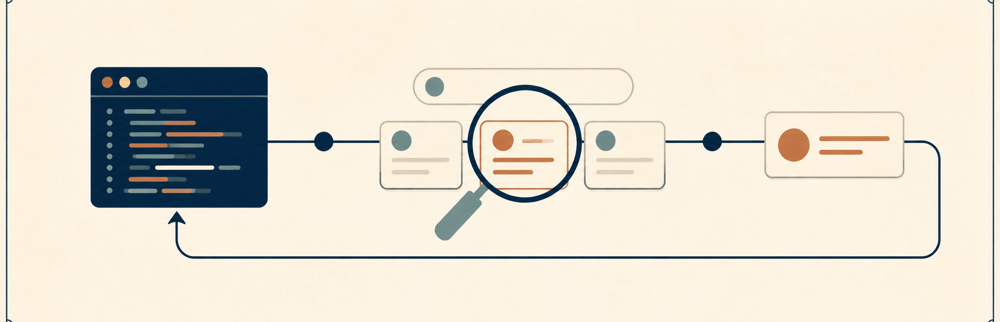
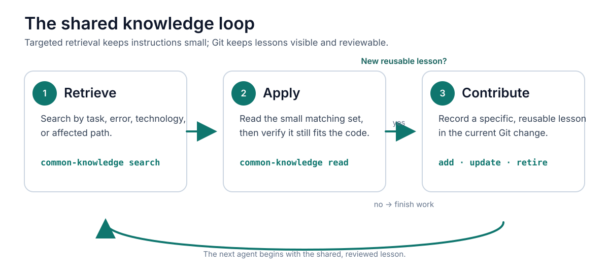

# Common Knowledge



Common Knowledge is a Git-native shared project knowledge layer for coding
agents and developers.

What one coding agent learns, every agent can use.

It keeps concise, project-specific engineering lessons in the repository rather
than in one agent's local memory or an ever-growing instruction file. Entries
are ordinary Markdown files: Git carries them, reviewers can inspect them, and
any harness can use the same CLI.

## Current status

The v1 prototype is complete. The CLI initializes a Corpus and supports
searching, reading, adding, updating, retiring, and validating Entries. The Java
21 mock repository and [clean-clone two-agent demonstration](docs/two-agent-handoff.md)
show that one agent can record a lesson and a later independent agent can
retrieve and apply it through the same packaged CLI and repository filesystem.

## Engine and repository installation

This repository develops the Common Knowledge Engine and proves the model with a
reference fixture. A complete Common Knowledge Installation lives in the
Consumer Repository whose knowledge it manages. The CLI may be installed or
invoked from elsewhere; the Corpus, activation instructions, project artifacts,
and Git history remain together in the Consumer Repository. One installation
might look like this:

```text
consumer-repository/
  AGENTS.md               # Example Common Knowledge activation protocol
  .repo-memory/           # Repository-owned Corpus
    README.md
    schema.json
    log.md
    entries/
      <id>.md
  src/                    # Project artifacts affected by the knowledge
  tests/                  # Possible deterministic Promotion destinations
  <instruction files>     # Possible instructional Promotion destinations
  <skills>/               # Possible reusable Promotion destinations
```

The Common Knowledge Engine provides the repository-memory mechanism; each
Consumer Repository supplies the project knowledge and governs any resulting
changes through its normal Git workflow. A hosted service or database is not
required for this repository-local model.

## How it works



The repository is the source of truth. Common Knowledge writes working-tree
files only; it never stages, commits, pushes, or bypasses the repository's
normal review process.

## Quick start from this checkout

The package is not published to an npm registry during the prototype. Build the
CLI locally, then invoke it from the repository that should own the Corpus.

```sh
# In this Common Knowledge checkout
npm ci
npm run build

# In a target repository
node /absolute/path/to/common-knowledge/dist/cli.js init
```

`init` creates this repository-local layout:

```text
.repo-memory/
  README.md       # Corpus operating notes
  schema.json     # Normative Entry front-matter contract
  log.md          # Append-only activity log
  entries/
    <id>.md       # One Markdown Entry per lesson
```

## Agent protocol

Keep the repository-level agent instructions short. They should tell an agent
when to query the Corpus, not duplicate the Corpus itself.

```md
For relevant work, run `common-knowledge search` against the repository’s
`.repo-memory/` Corpus before changing code. Search using the task, affected
paths, technologies, commands, and observed errors. Read only relevant active
Entries and verify that they still apply. After resolving a specific, reusable
lesson, add, update, supersede, or retire an Entry in the current Git change.
```

Search first, then read the returned Entry when it looks applicable:

```sh
node /absolute/path/to/common-knowledge/dist/cli.js search "database connection refused" --path apps/api/src/main/java/example/App.java
node /absolute/path/to/common-knowledge/dist/cli.js read database-startup-order
```

Search is deterministic. It considers active Entries only, optionally filters
by kind and affected path, and ranks exact Trigger phrases, matching Scope,
Trigger-token overlap, and title-token overlap. It returns at most five results
with the reasons for each match.

## Creating an Entry

Create a small Markdown file with YAML front matter, then add it. The body must
contain `Situation` and `Resolution` sections.

```md
---
schema_version: 1
id: database-startup-order
kind: gotcha
title: Start the local database before the API
triggers:
  - connection refused
  - local API startup
scope:
  paths:
    - apps/api/**
sources:
  - apps/api/README.md
status: active
created_at: 2026-08-25T00:00:00Z
created_by: codex
---

## Situation

The API fails locally when its database is unavailable.

## Resolution

Start the documented local database service, then rerun the API command.
```

```sh
node /absolute/path/to/common-knowledge/dist/cli.js add database-startup-order.md
node /absolute/path/to/common-knowledge/dist/cli.js validate
```

Only record lessons that are project-specific, actionable, and likely to recur.
Do not add secrets, personal information, verbose task transcripts, or one-off
observations.

## Command reference

| Command | Purpose |
| --- | --- |
| `init` | Initialize `.repo-memory/` in the current working directory. |
| `search <query> [--path <path>] [--kind <kind>]` | Find relevant active Entries and show match reasons. |
| `read <id>` | Print one validated Entry. |
| `add <entry-file>` | Validate and add a new active Entry. An existing ID is rejected. |
| `update <entry-file>` | Replace an existing Entry's content or ordinary metadata while preserving its creation provenance. |
| `retire <id> --reason <reason>` | Mark an active Entry retired and record the reason. |
| `validate` | Validate all Entries, lifecycle links, and the activity log. |

Adding a new Entry with `supersedes: <old-id>` atomically marks the previous
Entry superseded and records both activity events. Use `update` for corrections
to the same lesson; use supersession when a new Entry replaces an older lesson.

## Safety and maintenance

- Each Corpus command uses a short-lived cooperative checkout lock, so a second
  Common Knowledge command fails with a retry diagnostic rather than observing
  a partial update.
- Mutating commands validate their complete candidate before changing the
  Corpus and restore original files after ordinary write failures.
- `log.md` is concise operational history; Git remains the authoritative audit
  trail and review mechanism.
- `npm run benchmark:search` provides non-gating explanatory evidence for the
  per-search Scope-pattern cache. It verifies reduced repeated compilation; its
  elapsed-time output is machine-dependent.

## Documentation

- Canonical design: [`docs/prototype-spec.md`](docs/prototype-spec.md)
- Implementation contract: [`docs/PRD.md`](docs/PRD.md)
- Domain vocabulary and principles: [`CONTEXT.md`](CONTEXT.md)
- Architecture decisions: [`docs/adr/`](docs/adr/)
- Agent/issue/review workflow: [`AGENTS.md`](AGENTS.md) and
  [`docs/agents/`](docs/agents/)

## Development checks

```sh
npm run preflight       # type-check, repository lint, focused CLI/filesystem tests
npm test                # complete test suite
npm run verify:package  # build, pack, install, and execute in isolation
```

## Search benchmark

Run `npm run benchmark:search` to generate a fixed temporary Corpus and compare
the naive repeated Scope-pattern compilation baseline with the per-search
strategy. The benchmark warms both strategies, reports medians from multiple
samples, and verifies the deterministic reduction in Scope-pattern compilations.
It is explanatory evidence only: elapsed time is machine-dependent and does not
claim a universal production speedup.
